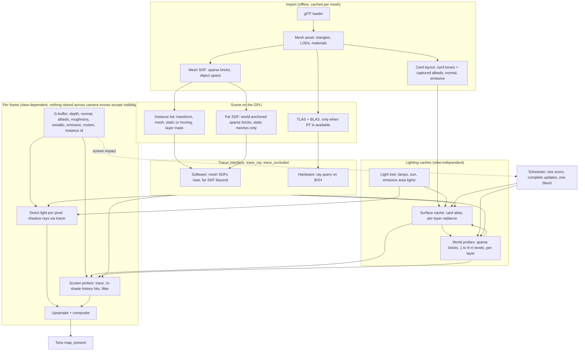

# GI v2: design

Status: proposed, 2026-10-10; Anthony's answers to the open questions folded in the same day. No code yet. The decision is [ADR 0012](../adr/0012-gi-v2.md).

This is the plan for the next global illumination (GI) system in Genos Engine. It replaces what is left of radiance cascades ([ADR 0008](../adr/0008-lighting-uses-radiance-cascades.md)) and the analytic occluder grid ([ADR 0011](../adr/0011-occluders-use-a-sparse-camera-box.md)). The current system is described in [Lighting](lighting.md) and [the handoff](lighting-handoff.md). The quality gate is in [Debugging](debugging.md).

## Why change

The current lighting traces analytic boxes, cylinders and planes in a camera-centred 2 m grid. It stores bounce light in world probes (1 m lattice, 4 m bricks), adds short near-field rays per pixel, and falls back to a coarse 2.5 m world volume. It works for the stress scene, but:

- Future assets are arbitrary meshes. The tracer only knows our fixed shapes.
- Most remaining errors are at thin walls, corners and contact (the black corner in room A, the +20 % wall-floor edges). Probes on a 1 m lattice cannot fix those on their own.
- The probe update rules grew into many special cases (snap rules, notice bands, idle-only rebuilds, outside-camera rules). Several caused pops.
- The software walk is fragile on the NVIDIA compiler, and there is no path for hardware ray tracing.

Lumen (Unreal Engine 5) solved most of these problems with three ideas: a mesh-based trace target (distance fields or a hardware BVH), a surface cache of light stored on meshes, and screen probes for the final gather. We treat Lumen as a proven reference to learn from, not a blueprint. We copy what it has proven, and diverge where its choices cause the problems we are fighting (pops, lag, ghosting, cost of moving lights) or where our constraints differ (a memory budget we can spend, a reference gate, an old-GPU floor). The section [Lumen: what we copy and where we diverge](#lumen-what-we-copy-and-where-we-diverge) lists each choice and why.

## Lumen: what we copy and where we diverge

Lumen is the best-tested real-time GI in shipped games, so where it has solved a problem the same way we would, we copy it and save the years. Where its choices are the source of known artefacts, or where our constraints differ, we do something else and say why.

| Topic | Lumen | Genos GI v2 | Copy or diverge, and why |
|---|---|---|---|
| Software trace target | Per-mesh SDFs near, a merged global SDF in camera-centred clipmaps far | Per-mesh SDFs near, a merged far SDF in world-anchored sparse bricks; level chosen by distance along the ray | **Copy** the per-mesh SDF idea (proven, handles arbitrary meshes). **Diverge** on the far field: camera clipmaps change the answer as the camera moves, which is exactly the pop class we keep fixing. |
| Hardware trace | Inline ray tracing against a BVH, surface cache at hits | Ray queries from compute against a BVH, surface cache at hits | **Copy.** Proven, and it keeps one pass structure for both tracers. |
| Light on surfaces | Surface cache of mesh cards | Surface cache of mesh cards | **Copy** the cards. **Diverge** on resolution: Lumen picks card resolution by distance to the camera; we fix it per mesh at import, so walking toward a wall never changes its light. |
| Final gather | Screen probes, octahedral rays, importance sampling, plane-weighted upsample | The same | **Copy.** This is the part that fixes thin walls, corners and contact, and it costs the same however big the scene is. |
| Temporal reuse | Radiance accumulated over frames, then denoised | Visibility (ray hits) reused, light re-read every frame; no radiance history | **Diverge.** Accumulated radiance is the source of Lumen's light lag and ghosting. Re-shading kept hits is cheap because the surface cache already holds the light. It also saves the memory a radiance history would need. |
| Far and off-screen cache | World-space radiance cache: probes in clipmaps around the camera, refreshed as it moves | Persistent world-anchored probe bricks (1 to 8 m levels), updated by one scheduler | **Diverge.** Persistent probes survive camera moves, so turning around costs nothing and never re-converges. We spend memory to keep them. |
| Update order | Fixed per-frame budgets, priority by distance and feedback | One score: screen impact x expected error, plus waiting time; complete updates, one blend | **Diverge.** Partial updates shown over many frames are what look like slow fades and pops. |
| Direct light | Shadow maps (virtual shadow maps), and stochastic light sampling with a denoiser for many lights (MegaLights) | Traced shadow rays per pixel, a deterministic light-tree cut per tile, cached shadow masks for static lights | **Diverge.** Deterministic choices need no denoiser and no history. Cached masks trade memory for rays. Shadows match the reference because they use the same tracer. |
| Moving and switchable lights | Card direct lighting is recomputed for the lights that touch a card | A layer per moving light; on, off, dim and colour are a multiply | **Diverge.** Light is linear, so storing each moving light's part separately makes toggles free. This was our design before v2 and stays. |
| Moving objects | Part of the global SDF and surface cache updates; they dirty what they pass | Carry their own cards and an object-space proxy; static layers ignore them | **Diverge.** A box rolling across a room should not relight the room's cache. |
| Emissive surfaces | Light the scene through the surface cache (noisy for small bright emitters) | Through the surface cache, plus bright emitters become area lights in the light tree | **Copy** the cache path; **add** area lights so small bright emitters get clean direct light and shadows. |
| Quality check | Visual comparison against the path tracer | A reference path tracer, numeric compare and regression scripts as a gate on every phase | **Ours.** We measure every change, on both tracers. |
| Hardware floor | Software Lumen on DX11/SM5-class, hardware Lumen on DXR | Vulkan 1.3 floor from the Steam 80 % rule, hardware RT optional | **Same shape** (two tracers), floor chosen from data. |
| Memory | Tuned to fit large open worlds on consoles | About 200 MB on lighting (a soft budget), spent to make each pixel cheaper | **Diverge.** We have room to cache more, so we do (see [Trading memory for speed](#trading-memory-for-speed)). |

Where we hope to do better than Lumen: no pops from camera movement (stored light is view-independent), no ghosting or light lag (no radiance history), free light toggles (layers), cheaper low-end frames (caches instead of rays), and a numeric gate against ground truth.

Where Lumen is still ahead and we accept it for now: specular reflections, translucency, very large open worlds with streaming, and skinned meshes in the GI.

## Goals

1. Arbitrary meshes are the normal asset. Analytic shapes become meshes.
2. One GI design with two tracers: a software tracer that runs on every supported GPU, and a hardware ray tracing (RT) tracer on GPUs that have it. Everything above the tracer is shared.
3. Static scenes match the reference path tracer: mean relative error under 3 % on every standard view (`reference_views.rhai`), on both tracers.
4. Lighting is view-independent. What is stored (surface cache, world probes, layers) never depends on where the camera is. The camera only decides update order and what is resident.
5. No pops and no ghosting. A light that changes shows its change in one smooth step. A moving object leaves no trail.
6. Moving lights are cheap: on, off and dimming cost nothing. Moving objects never dirty static GI.
7. Simple rules. One priority score, complete updates, one blend. Each rule has a test.
8. Performance targets (see Presets): basic scene above 500 fps at 1440p on the RTX 4070; stress scene at max settings about 100 fps; the floor GPU runs the Low preset at 60 fps at 1080p.

## Non-goals (for v2)

- Specular reflections and mirrors. We store roughness and metallic now so they can come later.
- Fog, volumetrics and god rays. GI v2 leaves room for a froxel volume that reads the same caches.
- Translucent surfaces receiving GI.
- Exact GI from skinned (animated) meshes. They use proxies.
- Baked lightmaps. Everything stays dynamic.
- Mesh shaders, virtual geometry (Nanite-style) or anything that needs features above the floor.

## Hardware targets

Rule from Anthony: support at least the newest 80 % of Steam users. This is a dated snapshot. Re-check it every six months, and before any release.

Source: [Steam Hardware & Software Survey, September 2026](https://store.steampowered.com/hwsurvey/videocard/) (fetched 2026-10-10), "All video cards" table, plus the VRAM and resolution tables on [the main survey page](https://store.steampowered.com/hwsurvey/). The named cards cover 91.64 %. "Other" is 8.33 % and is not broken down; we count it as below the floor, which is the cautious reading.

### Cards by architecture, newest first

| # | Architecture (year) | HW RT | Share | Cumulative | Cards in the survey (share %) |
|---|---|---|---|---|---|
| 1 | NVIDIA Blackwell (RTX 50) (2025) | yes | 22.98% | 22.98% | RTX 5070 6.15, RTX 5060 4.40, RTX 5060 Ti 4.06, RTX 5060 Laptop 2.45, RTX 5080 1.98, RTX 5070 Ti 1.87, RTX 5070 Laptop 0.64, RTX 5070 Ti Laptop 0.41, RTX 5090 0.40, RTX 5050 Laptop 0.39, RTX 5050 0.23 |
| 2 | AMD RDNA 4 (RX 9000) (2025) | yes | 2.39% | 25.37% | RX 9070 XT 1.42, RX 9060 XT 0.77, RX 9070 0.20 |
| 3 | Intel Arc (2023) | yes | 0.25% | 25.62% | Intel Arc Graphics 0.25 |
| 4 | NVIDIA Ada (RTX 40) (2022) | yes | 20.22% | 45.84% | RTX 4060 3.89, RTX 4060 Laptop 3.50, RTX 4060 Ti 2.85, RTX 4070 2.11, RTX 4070 SUPER 1.74, RTX 4050 Laptop 1.59, RTX 4070 Ti 0.88, RTX 4070 Laptop 0.86, RTX 4070 Ti SUPER 0.71, RTX 4090 0.67, RTX 4080 SUPER 0.63, RTX 4080 0.62, RTX 4080 Laptop 0.17 |
| 5 | AMD RDNA 3 (RX 7000, 780M) (2022) | yes | 2.26% | 48.10% | RX 7800 XT 0.59, RX 7600 0.46, RX 7900 XTX 0.40, RX 7900 XT 0.30, Radeon 780M 0.27, RX 7700 XT 0.24 |
| 6 | NVIDIA Ampere (RTX 30, RTX 2050) (2020) | yes | 17.81% | 65.91% | RTX 3060 3.66, RTX 3050 2.90, RTX 3060 Ti 2.08, RTX 3070 1.97, RTX 3060 Laptop 1.66, RTX 3080 1.30, RTX 3070 Ti 0.88, RTX 3050 6GB Laptop 0.64, RTX 3050 Ti Laptop 0.56, RTX 3080 Ti 0.50, RTX 2050 0.42, RTX 3070 Laptop 0.39, RTX 3050 Laptop 0.33, RTX 3090 0.32, RTX 3070 Ti Laptop 0.20 |
| 7 | AMD RDNA 2 (RX 6000) (2020) | yes | 2.33% | 68.24% | RX 6600 0.75, RX 6700 XT 0.49, RX 6600 XT 0.25, RX 6650 XT 0.23, RX 6750 XT 0.23, RX 6800 XT 0.21, RX 6500 XT 0.17 |
| 8 | Intel Xe iGPU (Iris Xe, Gen12) (2020) | no | 1.52% | 69.76% | Iris Xe Graphics 1.52 |
| 9 | Intel Xe iGPU, unnamed (2020+) | no | 0.47% | 70.23% | "Intel(R) Graphics" 0.47 |
| 10 | NVIDIA Turing GTX (GTX 16) (2019) | no | 5.22% | 75.45% | GTX 1650 2.19, GTX 1660 SUPER 1.26, GTX 1660 Ti 0.78, GTX 1660 0.42, GTX 1650 Ti 0.32, GTX 1650 SUPER 0.25 |
| 11 | AMD APU, unnamed (Vega or RDNA 2) (2019) | no | 2.75% | 78.20% | "AMD Radeon Graphics" 1.51, "AMD Radeon(TM) Graphics" 0.82, "AMD Radeon (TM) Graphics" 0.42 |
| 12 | AMD RDNA 1 (RX 5000) (2019) | no | 0.49% | 78.69% | RX 5700 XT 0.49 |
| 13 | NVIDIA Turing RTX (RTX 20) (2018) | yes | 3.92% | 82.61% | RTX 2060 1.53, RTX 2060 SUPER 0.71, RTX 2070 SUPER 0.62, RTX 2070 0.41, RTX 2080 SUPER 0.24, RTX 2080 Ti 0.21, RTX 2080 0.20 |
| 14 | AMD Vega APU (2018) | no | 0.42% | 83.03% | Radeon Vega 8 0.26, Radeon Vega 3 0.16 |
| 15 | Intel Gen9-11 iGPU (UHD) (2017) | no | 2.28% | 85.31% | "Intel(R) UHD Graphics" 1.06, "Intel UHD Graphics" 0.61, UHD 620 0.38, UHD 630 0.23 |
| 16 | NVIDIA Pascal (GTX 10) (2016) | no | 4.35% | 89.66% | GTX 1060 1.34, GTX 1050 Ti 1.03, GTX 1070 0.54, GTX 1050 0.47, GTX 1080 0.34, GTX 1080 Ti 0.27, GT 1030 0.18, GTX 1070 Ti 0.18 |
| 17 | AMD Polaris (RX 400/500) (2016) | no | 1.49% | 91.15% | RX 580 2048SP 0.51, RX 580 0.49, RX 570 0.31, RX 550 0.18 |
| 18 | Intel Gen9 iGPU (HD 520/620) (2015) | no | 0.33% | 91.48% | HD 520 0.17, HD 620 0.16 |
| 19 | NVIDIA Maxwell (GTX 900) (2014) | no | 0.16% | 91.64% | GTX 970 0.16 |
| - | Other (not named) | ? | 8.33% | 99.97% | - |

Notes on the grouping. Unnamed "AMD Radeon Graphics" rows are Ryzen APUs; most are Vega or RDNA 2, so we place them with the 2019 group and assume no RT. "Intel Arc Graphics" is most likely the Meteor Lake integrated GPU. A small error in either moves the line by well under 1 %.

### What the numbers say

- **80 % line.** Counting newest first, the 80 % line is crossed in the 2018 generation (row 13, 82.6 %). Including the 2018 Vega APUs gives 83.0 %. So the floor is the 2018-2019 class: NVIDIA Turing (GTX 16 and RTX 20), AMD RDNA 1, Ryzen Vega APUs, and Intel Xe (Gen12) integrated graphics.
- **Extended floor (Anthony, 2026-10-10).** Low is also tuned for NVIDIA Pascal (GTX 10) and AMD Polaris (RX 400/500): another 5.84 %. With them, the supported set is rows 1-14 plus 16-17, about 88.9 % of all users. The GTX 1060 was Anthony's own card.
- **Below the floor** (about 11 %): Intel UHD and HD Gen9-11 integrated graphics (2.6 %), NVIDIA Maxwell GTX 900 (0.16 %), and the unnamed "Other" (8.33 %). They are best effort: not blocked if the driver has the features, not tuned, not gated.
- **Hardware RT share:** 72.2 % of all users (78.7 % of the named cards): RTX 20 and newer, RX 6000 and newer, and Intel Arc. RT is the common case, not the exception, but the software path is needed for about a quarter of users and for macOS.
- **Integrated GPUs:** 8.3 % of all users (Intel Xe, UHD, HD, Ryzen APUs, 780M). Laptop discrete GPUs are counted separately and are not included here.
- **VRAM:** 16 GB 27.2 %, 12 GB 13.1 %, 8 GB 26.7 %, 6 GB 5.1 %, 4 GB 5.1 %, 3 GB 1.2 %, 2 GB 3.7 %, 1 GB 1.4 %, 512 MB 2.6 %; 10, 11, 20, 22, 24, 32 and 64 GB together 12.6 %. At least 8 GB: 79.6 %. At least 6 GB: 84.7 %. At least 4 GB: 89.8 %. Integrated GPUs report small numbers here because they share system memory.
- **Resolution:** 1920x1080 is 47.9 %, 2560x1440 is 27.0 %, 3840x2160 is 4.8 %.

### Chosen floor

- **Graphics API:** Vulkan 1.3 core, with these features required: `descriptorIndexing` (runtime arrays, partially bound, non-uniform indexing, update-after-bind for the card atlas and SDF pool), `bufferDeviceAddress`, `timelineSemaphore`, `scalarBlockLayout`, `synchronization2`, `dynamicRendering`, `maintenance4`, `shaderDrawParameters`, `storageBuffer16BitAccess`, `subgroupSizeControl`, and subgroup basic, vote, ballot and arithmetic in compute. `shaderFloat16` is used when present but is not required. Vulkan 1.4 is not required. MoltenVK has shipped Vulkan 1.3 since 1.3.0 (May 2025). The engine requests Vulkan 1.0 today (`API_VERSION` in `gpu.rs`), so this is a raise.
- **Hardware RT (optional):** `VK_KHR_ray_query`, `VK_KHR_acceleration_structure` and `VK_KHR_deferred_host_operations`. We use ray queries from compute shaders, not ray tracing pipelines, so both tracers share the same pass structure. The hardware tracer is chosen only when `VK_KHR_ray_query` is present. Pascal's driver exposes `VK_KHR_acceleration_structure` without ray queries (a slow emulation), so checking for acceleration structures alone would pick the wrong tracer. MoltenVK has no released ray query support yet (an experimental pull request exists), so macOS uses the software tracer. That is accepted.
- **Minimum VRAM:** 4 GB on discrete GPUs. It stays at 4 GB because memory has become expensive with AI demand, so players are not upgrading it quickly. 89.8 % of Steam users have at least 4 GB. The GTX 1060 3 GB is below this line; the 6 GB model is the reference. Integrated GPUs need 8 GB of system RAM.
- **Lighting memory:** about 200 MB is a soft budget. Anthony accepts about 200 MB of a 4 GB card going to lighting without question. Ultra may go over it when that buys speed (see [the VRAM budget](#vram-budget)).
- **Low reference card:** GTX 1060 6 GB (Pascal, 2016). The RX 580 8 GB (Polaris) is its AMD equivalent and must also run Low well. Low targets 60 fps at 1080p on both. Newer floor cards (GTX 1650, RX 5500/5700) are about as fast or faster, so tuning for the 1060 covers them. The integrated target is Iris Xe at 1080p 30 fps or 720p 60 fps.
- **Steam Deck:** a target, but untested; there is no device to test on. It probably sits in "Other" in the survey. Its GPU (RDNA 2) is above the floor, and RADV on SteamOS should expose ray queries on it, so it may pick the hardware tracer; the Low or Medium preset at 800p is the likely fit.

### Feature check on Pascal and Polaris (gpuinfo.org)

Checked 2026-10-10 against the newest reports on the [Vulkan Hardware Database](https://vulkan.gpuinfo.org) for each card and OS: report 51058 (GTX 1060 6GB, Windows, NVIDIA 582.66, Vulkan 1.4.312), 52074 (GTX 1060 6GB, Linux, NVIDIA 580.178, Vulkan 1.4.312), 40823 (RX 580 2048SP, Windows, AMD 2.0.283, Vulkan 1.3.264) and 52304 (RX 580, Linux, RADV Mesa 26.2.4, Vulkan 1.4.354).

| Feature | GTX 1060 Win | GTX 1060 Linux | RX 580 Win | RX 580 Linux |
|---|---|---|---|---|
| Vulkan version | 1.4 | 1.4 | **1.3** | 1.4 |
| descriptorIndexing (all the parts above) | yes | yes | yes | yes |
| bufferDeviceAddress | yes | yes | yes | yes |
| timelineSemaphore, scalarBlockLayout | yes | yes | yes | yes |
| synchronization2, dynamicRendering, maintenance4 | yes | yes | yes | yes |
| shaderDrawParameters, storageBuffer16BitAccess | yes | yes | yes | yes |
| subgroupSizeControl, computeFullSubgroups | yes | yes | yes | yes |
| Subgroup basic, vote, arithmetic, ballot in compute | yes | yes | yes | yes |
| Subgroup size | 32 | 32 | 64 | 64 |
| shaderFloat16 | **no** | **no** | **no** | **no** |
| VK_KHR_ray_query | no | no | no | no |
| maxImageDimension3D | 16384 | 16384 | **2048** | **2048** |

What this changes:

- **No required feature is missing.** Pascal and Polaris both meet the Vulkan 1.3 floor as written, so no fallback path is needed.
- **The floor stays Vulkan 1.3, not 1.4.** AMD's Windows driver for Polaris stops at Vulkan 1.3.264, and its driver is in maintenance, so 1.4 would cut the RX 580 on Windows. NVIDIA's 580/582 branch is the last for Pascal, so its features are frozen too.
- **`shaderFloat16` stays optional.** Neither card has it. Shaders keep a 32-bit path and only use 16-bit floats where present.
- **Shaders must not assume a subgroup size.** It is 32 on NVIDIA and 64 on Polaris. Write subgroup code that works for any size, and use `subgroupSizeControl` where a pass needs a fixed one.
- **3D textures stay at or under 2048 per side** (the SDF brick pools and the occupancy grid). Polaris caps 3D images at 2048.
- Pascal has weak async compute and coarse preemption, so the short GPU submissions we already use (so the desktop stays responsive) matter even more there.

Re-check this table when a driver branch changes, and add the GTX 1650, Iris Xe and Vega 8 the next time the floor is reviewed.

### Test machines

- **zanven-pc:** Linux (Omarchy), RTX 4070. The hardware tracer, Ultra and High, and the software tracer forced on (`GENOS_TRACER=sw`) as a stand-in for old cards.
- **Anthony's MacBook:** macOS, software tracer through MoltenVK.
- **Not available:** a GTX 1060, RX 580, GTX 1650, Iris Xe or Steam Deck. Until one is available, Low is tuned on the 4070 with the software tracer forced on and a time budget scaled down to the floor card's speed, and the floor numbers in this doc are estimates. Getting a floor card is still open.

## The design in one picture



## Per-frame data flow

1. **CPU: changes.** Collect what changed since last frame: lights moved, dimmed or toggled; instances moved; materials changed; the sun or sky moved. Each change becomes a list of affected cards and probe bricks (by bounds and light range, never by camera position). Update instance transforms. Refit the TLAS for moved instances when RT is on.
2. **G-buffer.** Depth prepass, then one raster pass writing normal, albedo, roughness, metallic, emissive, motion vectors and instance id. Meshes are drawn from the shape pool as now.
3. **Scheduler.** Read last frame's screen-impact counters (which cards and bricks the picture used). Pick this frame's card pages and probe bricks by one score (below). Fill a fixed GPU time budget.
4. **Surface cache update.** For each picked card page: direct light per texel (shadow rays via the tracer, light tree), then indirect per texel from world probes. Write into a working copy of the page. Readers never see the working copy; when the page is finished it is published and blended in once.
5. **World probe update.** For each picked brick: trace each probe's rays with the tracer. A hit reads the surface cache at the hit (that is the bounce). A miss reads the next coarser probe level, then the sky. Write into a working copy of the brick; publish it when finished and blend once. Nothing runs here unless a change touched the brick (see [Near and far](#near-and-far-one-answer-per-ray-no-double-work)).
6. **Direct light per pixel.** Sun and the light tree's chosen lights, one shadow ray each, through the same tracer.
7. **Screen probes.** Place probes on the G-buffer every N pixels. Reuse last frame's ray hits where they pass the reuse rules, trace the rest. Rays stop at the screen probe range; a hit is shaded from the published surface cache, and a ray that reaches the range without a hit takes the published world probes (far field) or the sky. Integrate, then filter across neighbouring probes.
8. **Upsample and composite.** Each pixel blends its nearby screen probes. Final colour is albedo times (direct + indirect) plus emissive, then the tone curve.

Steps 4 and 5 are budgeted and spread over frames. Steps 6 to 8 run every frame at a fixed cost set by the preset. The GPU sharing work (short submissions, low priority for scripts) applies to all of them.

## Scene representation

All of this is built per mesh and cached. A mesh that does not change never rebuilds.

When it is built is a config option: at build time (prebuilt into the shipped assets), or at first load (cached on the player's disk). The default for our editor is prebuilt at build time. Which one a shipped game should use is not decided yet.

### Mesh asset

- Triangles with positions, normals, tangents and UVs, plus material slots. Up to 4 LODs; GI uses a simplified LOD where the preset says so.
- Bounds and a "thin" flag set when the mesh has sheets thinner than the SDF voxel (planes, leaves). Thin meshes are treated as two-sided in the SDF and in cards.
- Analytic shapes (floor, walls, boxes, cylinders) are generated as meshes through the same path. Their SDF is generated exactly from the shape instead of from triangles. The rest of the engine does not know the difference.

### Mesh SDF (software tracer)

- One signed distance field per mesh, in object space, stored as sparse 8^3 bricks in a shared 3D texture pool. Only bricks near the surface are stored (a narrow band of a few voxels), with one coarse mip that covers the whole bounds for fast skipping.
- Voxel size comes from the mesh size, about 1/64 of its largest side, clamped to 2-25 cm. Presets can halve it.
- Moving instances use their mesh SDF through their transform, so moving costs nothing to rebuild.
- Known weakness: a wall thinner than about two voxels can leak. Import warns about it, and the thin flag makes such meshes two-sided. This is the risk we care most about, given our history with leaks.

### Far SDF (software tracer, long rays)

- A merged distance field of static meshes only, in sparse bricks anchored to the world (not a camera clipmap), at four levels: 0.25, 0.5, 1 and 2 m voxels.
- A ray uses the mesh SDFs of nearby instances for its first few metres, then switches to the far SDF. The level is chosen by the distance along the ray, never by camera distance. That keeps stored lighting view-independent.
- Residency follows the camera with hysteresis, as bricks do now. If a ray needs a brick that is not resident, its result is marked provisional and the work is redone when the brick arrives. The camera decides what is resident and in what order; it never decides the answer.
- A static mesh that is added, removed or moved rebuilds only the bricks it overlaps.

### BVH (hardware tracer)

- One bottom-level structure (BLAS) per mesh LOD, built on the GPU at load, compacted. A top-level structure (TLAS) per frame, refit for moving instances and rebuilt when the instance set changes.
- Instance masks split static, moving, and "casts no GI" instances, so static lighting can ignore moving objects (see Light layers).

### Analytic shapes

They stay as the scripting API (`wall`, `solid`, `floor`), but become mesh instances. `occ_grid.rs` and the shape walk in `scene_rays.glsl` go away once both tracers are in.

## Tracer interface

Everything above the tracer calls two functions. The software and hardware versions live in separate GLSL files, selected at pipeline build time.

```text
trace_ray(origin, dir, t_min, t_max, mask) -> Hit { t, instance, normal, card_uv or position }
trace_occluded(a, b, mask) -> bool
```

- `mask` picks static, moving, or both.
- A hit always resolves to a surface cache lookup: instance, then card, then texel. The software tracer finds the card from the SDF hit position and gradient normal; the hardware tracer uses the triangle hit and its interpolated normal. Both then read the same atlas.
- The hardware tracer gives exact hits and sharper contact. The software tracer is slightly soft at thin features. Quality must match within the reference gate; the hardware path is only allowed to be faster and sharper.
- Rules from the NVIDIA compiler failures still hold: one trace call site per shader where possible, loop bounds read from data with `[[dont_unroll]]`, no large constant trip counts, small shaders. Every tracer change gets a short 4070 compile test before it lands.
- Rust side: a `Tracer` enum (`Software`, `Hardware`) chosen at startup from device features and a setting. `GENOS_TRACER=sw` forces software on an RT card.

## Surface cache

Light stored on meshes, so that every ray hit can be shaded with one texture read instead of a new light calculation. This is how Lumen gets cheap infinite bounce, and it is what fixes our corners and wall bases: a ray that hits the floor 10 cm away reads the floor's real light.

### Cards

- At import, each mesh gets a small set of cards: oriented boxes that each capture the mesh from one side. A simple mesh gets 6 axis-aligned cards. A complex mesh gets more, placed by a greedy cover of its surface, up to a cap (32 by default). Each card captures albedo, normal, emissive and depth by rasterizing the mesh at import.
- Card texel density is fixed per mesh at import (12 cm at Low and Medium, 8 cm at High, 6 cm at Ultra; presets scale it globally). It is never chosen by camera distance, so a card does not change resolution as you walk up to it.
- At runtime, cards live in one atlas made of fixed-size pages (for example 128x128). Far-away cards can be evicted; an evicted card falls back to world probes. Eviction is a residency choice, so it is camera-driven, but the stored values are not.

### Lighting a card texel

- **Direct:** the sun and the light tree's lights for that texel, one shadow ray each through the tracer. Same light units as the picture.
- **Indirect:** irradiance from the world probes at the texel position and normal (cheap). At High and above, a few hemisphere rays per texel at a lower resolution replace the probe read near corners.
- **Emissive:** added as is.
- The texel stores outgoing radiance (albedo times incoming, plus emissive). A ray hit reads that directly.
- Infinite bounce comes from the loop: cards read probes, probes read cards. Each update adds a bounce, as now. The estimate for the remaining bounces (last bounce times r / (1 - r), with r measured per probe) is tested here too, and stays only if it improves settle time without hurting reference error.

### Moving objects carry their cards

A moving instance's cards are in object space and move with it. They are lit like any other card (direct every update; indirect from the world probes around the object). Their light is read when a ray hits the object. Nothing about the object is written into static data.

## World probes (radiance cache)

The world probes stay, as the far field and the bounce source for the surface cache. They never light a near pixel directly (see [Near and far](#near-and-far-one-answer-per-ray-no-double-work)). They change in three ways:

1. Rays hit meshes through the tracer, and a hit reads the surface cache instead of computing light at the hit.
2. The probe grid gets coarser levels (1, 2, 4 and 8 m) in the same brick structure. These replace the 2.5 m world volume. All levels update through the same scheduler, whenever a change touches them. There is no "only when idle" rebuild, which removes the sun pop at its root.
3. Each brick stores its light per layer (see Light layers).

Probes still: sit on a world-anchored lattice; skip being inside geometry; get pushed off surfaces; store hit distances so a pixel can skip a probe that cannot see it (the DDGI-style test). The bleed fixes in our notes stay.

## Final gather: screen probes

Screen probes replace the per-pixel probe sampling, the near-field rays and the screen cascades.

- **Placement.** One probe per N x N pixel tile, on the G-buffer surface at the tile's centre (N = 32 at Low, 16 at Medium and above). Tiles with a depth or normal edge get one or two extra probes on the far side of the edge, from a fixed pool (25 % of the probe count at Ultra, 10 % below).
- **Rays.** Each probe traces M rays (64 at Low, 128 at Ultra) in a fixed, stratified octahedral pattern. The pattern's rotation comes from a hash of the probe's world cell, not the frame number, so the same probe shoots the same directions every frame. Any noise left is a fixed pattern that does not crawl. There is no importance sampling from last frame's light in v2; it would change the directions every frame. The first part of each ray is checked against the depth buffer (a short screen trace, as in Lumen), then the tracer takes over, out to the screen probe range `R` (below). A hit reads the published surface cache. A ray that reaches `R` without a hit reads the published world probes at its end point, in its direction (the far field). A ray that leaves the scene reads the sky.
- **Temporal reuse without ghosting.** We reuse visibility, not light. Each probe ray keeps its last hit (instance, card texel, distance). Next frame, a reprojected probe may keep a ray's hit only if: the probe's position and normal agree (plane-distance and angle tests); the hit instance has not moved; and the ray is not this frame's share for re-tracing (one ray in 4 at Low, one in 2 at High). A kept ray whose path crosses the swept bounds of an instance that moved this frame is re-traced at once, so a box that rolls into a ray is seen in the same frame. With a still camera and nothing moving, re-tracing is skipped: the same directions would return the same hits. Kept hits are shaded again from the current surface cache every frame. So a light that turns off goes dark this frame, and a moving object leaves no trail, because the light is never averaged over time. Visibility history is capped at 8 frames. There is no exponential moving average of radiance anywhere in the final gather.
- **Filtering.** Noise is handled by more rays and a spatial filter across neighbouring probes (3x3, weighted by plane distance, normal and hit distance), not by long history.
- **Integration and upsample.** Each probe is reduced to irradiance (third-order spherical harmonics, or a small octahedral map at Ultra). Each pixel blends its 4 nearest probes with plane-distance and normal weights. If all 4 fail (thin geometry), the placement pass has already put an extra probe on that surface in the same frame, from the edge pool. If the pool is full, the pixel uses the closest-plane probe within 2 tiles, and the debug counter records it. A pixel never reads the world probes directly. At High and Ultra, one short contact ray per pixel (about 0.5 m) handles the smallest gaps.

## Near and far: one answer per ray, no double work

Two probe systems run, but they never answer the same question. Screen probes answer "what light reaches this visible pixel" out to a short range. World probes answer "what light arrives here from far away", and they are the bounce source for the surface cache. Each ray gets exactly one answer, from exactly one system.

### Who answers what

| Question | Answered by | World probes involved? |
|---|---|---|
| Direct light on a pixel | Per-pixel shadow rays (or cached masks) | No |
| Indirect light on a pixel, from surfaces within `R` | Screen probe rays hitting the published surface cache | Only through the card's own bounce (below) |
| Indirect light on a pixel, from beyond `R` | The published world probes at the ray's end point | Yes: the far field |
| A screen probe ray that hits an evicted or uncovered card | The published world probes at the hit point | Yes: a counted fallback |
| The bounce stored on a card texel | The published world probes at the texel | Yes: this is how bounces add up |
| Light off screen, for when the camera turns | The surface cache and world probes, already stored | Not recomputed |

Screen probe range `R` is the distance a screen probe ray is traced before it hands over: 6 m at Low, 8 m at Medium, 12 m at High and 16 m at Ultra. A longer `R` means fewer world-probe reads near the camera and more tracing. Inside a room, almost every ray hits a wall before `R`, so world probes contribute almost nothing directly. In the open, rays past `R` usually end on sky, which the world probes also hold as sky.

The world probes replace the long part of each ray. They do not repeat it. A screen probe ray never traces past `R`, and a world probe never shades a pixel. The world probes' 1 m level exists for the card bounce (cards everywhere need it, on screen or not, and it must not depend on the view), not for the near picture.

### Bounded weight

- A world probe reaches a near pixel by only two direct paths: the ray-past-`R` far field, and the evicted-card fallback. Both are counted per pixel by a debug view (`share:world`).
- Budget: in the standard indoor views, the world-probe share of a near pixel's indirect light (pixels within 10 m) is under 10 % on average. The fallback path is under 0.5 % of rays. Outdoor views are measured and must not grow from one phase to the next.
- The card bounce path is indirect by one more bounce, so a world-probe change reaches the picture only after the card update that reads it has finished and been published.

### Published values only

- Every cache (card pages, probe bricks, layer pages) has a published copy and a small pool of working slots. Updates write into a working slot. Readers (screen probes, cards, the picture) only read published copies, and nothing reads a working slot.
- When an update finishes, the slot is published at the end of the frame and blends in once, over a fixed 4 frames from the old published value. That is Anthony's rule: complete updates, one blend.
- A brick or page is only updated when a change touched it, or when it first becomes resident. Refinement stops once it reaches its target sample count. A static scene publishes nothing, so nothing in it can flicker.
- The working pool is small (64 bricks and 64 card pages in flight, about 6 MB at Ultra). It is counted in the scheduler row of [the VRAM table](#vram-budget).

### Cost in a static scene

With nothing changing, the frame runs the G-buffer, direct light (mostly cached masks at Low), the screen probes and the composite. The surface cache, the world probes, the far SDF and the BVH all do no work. The scheduler's budget is a cap, not something it tries to spend. A camera move costs only screen probe tracing and first fills for bricks that newly became resident; it never relights stored values.

## Direct lighting

- **Per pixel, via the tracer.** Every pixel gets real shadow rays to the sun and to its chosen lamps, through `trace_occluded`. The same function lights card texels, so the picture and the caches agree.
- **Light tree.** All point, spot and area lights go into a tree, clustered by position, colour and power. For each 16x16 pixel tile, the tree is cut to the K most important nodes for that tile (K = 4 at Low, 16 at Ultra). Each chosen node is one shadow ray per pixel. A far cluster that subtends a small angle is one light, as in our current CPU tree. The choice is deterministic per tile, so there is no noise and no temporal accumulation. A light that enters or leaves a tile's cut fades over a fixed 4 frames, with hysteresis on the cut, so a moving lamp cannot make tiles flick between two cuts. Light that falls outside the cut is small by construction; the light tree's error budget is checked against the reference.
- **Cached shadow masks for static lights.** Each card texel stores the shadow (visibility) of up to 4 static lights that matter most there, 8 bits each. A pixel on a static surface computes the light's falloff and angle from its own position and normal, then multiplies by the cached mask instead of tracing a ray. Low and Medium use masks for all static lights. High and Ultra trace real rays for the static lights within 10 m of the camera (sharp contact shadows) and use masks beyond. Masks are rebuilt only when static geometry or a static light changes.
- **Cached sun visibility.** The sun moves slowly, so each card texel also keeps a sun visibility value, refreshed by the scheduler as the sun moves. Low reads it per pixel instead of tracing; Medium and above trace the sun per pixel and use the cache for card lighting.
- **Light range.** The range cutoff (`lamp_range`) stays as a tree pruning rule, not a per-pixel loop.
- **Emissive surfaces as lights.** Every emissive surface lights the scene through the surface cache automatically (a ray that hits it reads its emission). Emissive meshes above a power threshold also become area lights in the light tree, so they cast sharp direct shadows. The threshold is a setting and is tested against the reference.

## Light layers

Light is linear. The total at any point is the sum of each light's contribution. We store the big contributors separately so they can change without recomputing anything.

- **Static layer.** Static lights, the sky and emissive surfaces. Recomputed only when static geometry or static lights change.
- **Sun layer.** The sun alone. It moves slowly and constantly, so it updates through the scheduler all the time. The sky colour scales its own part, so a sky fade is a multiply.
- **Per moving light layer.** Each light marked "moving" (or "switchable") gets its own layer: its direct and bounced light on the cards and probe bricks within its range, at unit intensity. On, off, dim and colour changes are a multiply at read time, so they are free. Moving the light recomputes its own layer only, by priority, and the light's direct term is exact every frame anyway because it is per pixel.
- **Layer cap.** Memory is cheap but not unlimited. Each preset has a layer cap (8 at Low, 32 at Ultra). Lights beyond the cap share one "dynamic rest" layer that updates by priority. The cap and a per-layer memory report are on the debug panel.
- **Reading layers.** Each card texel and probe stores per-layer radiance only in the pages and bricks the layer reaches. A reader sums the layers it overlaps, times each layer's current intensity. The screen probes do not care about layers; they read the summed value.
- **Per object (moving objects).** Moving objects never dirty static GI. Static layers trace with the "static only" mask, so a moving object is invisible to them. A moving object's effect reaches the picture three ways: its shadows are exact because direct light is per pixel and traced with all instances; its occlusion and bounce near the camera come from screen probes, which trace with all instances and read its own cards; and far from the camera (or off screen) a small object-space proxy around it (a few probes storing its occlusion and bounce colour, in its own frame) darkens and tints world probe reads nearby. That proxy moves with the object and is rebuilt only when the object's lighting changes, not when it moves.

## Scheduling: one score

One rule for every cache (card pages, probe bricks, layer pages):

```text
score = screen_impact x expected_error x (1 + waiting_time x k)
```

- `screen_impact`: how much of last frame's picture this page or brick lit, counted on the GPU from screen probe hits and pixel reads. Zero if the picture did not use it.
- `expected_error`: how wrong its stored light probably is, from the change list (the relative change of the light that touched it, or 1 for new geometry).
- The waiting term makes visible work that keeps losing eventually win. It multiplies the expected error, so work with no pending change scores zero and is never refreshed just because it is old. Work the picture does not use only runs with leftover budget, nearest first.
- Highest score first. Each picked item finishes completely in a working slot, is published at the end of the frame, then blends in once. No partial passes are shown, no snap rules, no notice-band skip, no outside or inside camera rules.
- The camera only changes the order. Every test that walks the camera (entrance walk, floor edge walk) must show no step in lighting.

## Materials

- glTF 2.0 metallic-roughness: base colour (factor and texture), metallic, roughness, emissive (factor, texture and strength), normal map, alpha mode (opaque and mask in v2; blend is drawn but gets no GI).
- GI uses diffuse albedo = base colour x (1 - metallic). Cards capture it at import.
- Roughness and metallic go in the G-buffer now, for specular later. A later specular pass can reuse screen probe rays for rough reflections and the surface cache for reflection hits.
- The current paint reflectance and colour mix become material parameters. The stress scene's defaults map to a white material with albedo 0.8.

## Presets and budgets

Budgets are GPU milliseconds per frame for the GI parts (surface cache + probes + screen probes + direct). The floor numbers are targets to verify on real hardware.

| Preset | Target GPU | Resolution, fps | Tracer | Screen probes | Rays per probe | Card texel | Probe levels | Light cut per tile | Moving-light layers | Lighting VRAM |
|---|---|---|---|---|---|---|---|---|---|---|
| Low | GTX 1060 6 GB, RX 580 (reference); GTX 1650, Iris Xe | 1080p 60 (Iris Xe 720p 60) | Software | every 32 px | 64, re-trace 1 in 4 | 12 cm | 1, 2, 4, 8 m | 4 | 8 | about 90 MB |
| Medium | RTX 2060, RX 5700 | 1080p 60-120 | Software or RT | every 16 px | 64, re-trace 1 in 3 | 12 cm | 1, 2, 4, 8 m | 8 | 16 | about 126 MB |
| High | RTX 3060, RX 6600 | 1440p 60-144 | RT if present | every 16 px | 96, re-trace 1 in 2 | 8 cm | 1, 2, 4, 8 m | 8 | 32 | about 152 MB |
| Ultra | RTX 4070 and up | 1440p 100+ | RT | every 16 px, extra probes on edges, contact rays | 128, re-trace 1 in 2 | 6 cm | 1, 2, 4, 8 m, denser 1 m reach | 16 | 32 | about 190 MB |

Low does not cut the caches much. The floor card is short on compute, not memory, so Low keeps the same card texel size as Medium and leans hardest on cached light and cached shadows.

GI time budgets per preset: Low 4 ms on the GTX 1060; Medium 3 ms; High 2.5 ms; Ultra up to 6 ms (the stress scene).

### Per-pass GPU budget

Estimates in GPU milliseconds per frame, to be replaced by measurements as each phase lands. "Static" means nothing moves (the camera may). "Moving" means lights and boxes moving, as in the stress runs. The surface cache, world probe and scene-update rows are caps the scheduler may spend when changes are waiting; with no changes they are zero. GTX 1060 numbers are estimates until a card is available.

| Pass | 4070, High, 1440p, basic scene, static | 4070, Ultra, 1440p, stress, moving | GTX 1060, Low, 1080p, static | GTX 1060, Low, 1080p, moving |
|---|---|---|---|---|
| Depth prepass + G-buffer | 0.35 | 1.5 | 2.0 | 2.0 |
| Direct light (shadow rays, cached masks) | 0.25 | 1.8 | 0.8 | 1.0 |
| Screen probe placement | 0.03 | 0.05 | 0.05 | 0.05 |
| Screen probe trace (to `R`) | 0.25 (0 with a still camera) | 1.1 | 1.0 (0 with a still camera) | 1.0 |
| Screen probe shade, integrate, filter | 0.15 | 0.45 | 0.3 | 0.3 |
| Upsample, contact rays, composite | 0.1 | 0.5 | 0.4 | 0.4 |
| Surface cache updates | 0 | 1.2 (cap) | 0 | 0.7 (cap) |
| World probe updates | 0 | 0.6 (cap) | 0 | 0.5 (cap) |
| Scene updates (TLAS refit, SDF patches, light tree) | 0 | 0.3 | 0 | 0.05 |
| Tone map, AA, copies | 0.15 | 0.3 | 0.5 | 0.5 |
| **GI total** (direct through scene updates) | **0.78** | **6.0** | **2.55** | **4.0** |
| **Frame total** | **1.28 (about 780 fps)** | **7.8 (about 128 fps)** | **5.05** | **6.45** |

The 4070 rows leave headroom on the targets (above 500 fps basic, about 100 fps stress). The GTX 1060 rows leave most of a 16.7 ms frame (60 fps) for the game itself. World probes cost nothing in a static scene and at most their cap when changes are waiting; they never run per pixel.


The 4070 targets, measured as now (release, 600 frames, after warmup):

- **Basic scene, 2560x1440, High: above 500 fps** (2 ms per frame total). GI must fit about 0.8 ms of that. At 16-pixel tiles, 1440p is 160x90 = 14,400 probes; at 96 rays with half re-traced that is about 0.7 M rays a frame, well within the 4070's RT rate for a small scene. Cache updates mostly sleep in a static scene.
- **Stress scene, 2560x1440, Ultra: about 100 fps** (10 ms), with lights and boxes moving.
- **Same scenes with `GENOS_TRACER=sw` on the 4070**, to keep the software path honest: within 2x of the RT times.

Scripted runs (benchmarks, regression scripts) ask for low GPU priority and keep submissions short, as already agreed. Only clean fps measurements need Anthony's GPU time windows.

## Trading memory for speed

Lighting uses about 10-20 MB of VRAM today (mostly the probe tier: up to 1024 bricks of 64 probes at 304 bytes each, about 20 MB). Anthony is happy to spend about 200 MB if it makes each pixel cheaper while looking very good. That is a soft budget: about 200 MB of a 4 GB card is accepted without question, and Ultra may go over it if that buys speed. Memory is cheap; per-pixel compute is what the floor card lacks. So every cache below exists to replace rays or maths per pixel with a read.

1. **Static light is cached, not recomputed.** The static layer (static lamps, sky, emissive) lives in the surface cache and the world probes, direct and bounced. A static scene runs no cache updates at all; the frame cost is the G-buffer, screen probes and per-pixel direct for moving lights.
2. **Cached shadow masks** for the 4 most important static lights per card texel, and a cached sun visibility value. They replace per-pixel shadow rays on Low and Medium, and far from the camera on High and Ultra.
3. **Denser, persistent world probes.** A 1 m level that reaches farther, plus 2, 4 and 8 m levels, all kept between frames and never thrown away when the camera turns. Each probe also stores its irradiance pre-integrated (second-order spherical harmonics per layer), so a card texel or a pixel reads one value per probe instead of decoding a cube.
4. **Precomputed probe visibility.** Each probe stores which of its 8 cell neighbours it can see (one byte). That replaces the per-pixel "does the segment to this probe cross a wall" ray we trace today.
5. **A larger surface cache.** 6-12 cm card texels, so a ray hit reads light at nearly pixel detail near the camera and screen probes need fewer rays to look clean.
6. **Per-light layers** for moving lights, so toggles and dimming are a multiply.
7. **Cached visibility for screen probes.** Ray hit records are kept for up to 8 frames, so only a quarter to a half of the rays are traced each frame. Light is still read fresh every frame, so this costs no ghosting.
8. **Precomputed distance fields and occupancy.** Per-mesh SDFs with a coarse mip, the far SDF, and a 1-bit occupancy grid (0.25 m cells) so software rays skip empty space in big steps. These are built once and only patched when static meshes change.

What we deliberately do not spend memory on: radiance history for temporal accumulation. It is what causes ghosting, and the caches above make it unnecessary.

## VRAM budget

Estimates in MB for a scene the size of the stress scene, at the preset's target resolution. "Lighting" is everything GI v2 owns. The BVH is listed separately because it scales with triangle count, not with the preset, and it will also serve reflections later. The G-buffer is rendering, not lighting, and is shown only for the fit check.

| Component | What it holds | Low (SW, 1080p) | Medium (SW, 1080p) | High (RT, 1440p) | Ultra (RT, 1440p) |
|---|---|---|---|---|---|
| World probes, all levels | Octahedral radiance, hit distances, pre-integrated irradiance, neighbour visibility; static and sun layers | 24 | 32 | 44 | 56 |
| Surface cache atlas | Albedo, normal, emissive, radiance per texel (about 16 B), static and sun layers | 24 | 24 | 40 | 48 |
| Shadow mask and sun cache | 4 static lights + sun visibility per texel | 8 | 8 | 10 | 12 |
| Moving-light layers | Radiance pages and probe irradiance within each light's range | 4 (8 lights) | 12 (16) | 24 (32) | 32 (32, wider reach) |
| Mesh SDF pool | Sparse 8^3 bricks, 8-bit distances, coarse mips | 16 | 24 | 0 | 0 |
| Far SDF and occupancy | World-anchored sparse bricks, 4 levels, 1-bit occupancy | 8 | 12 | 0 | 0 |
| Screen probes | Ray radiance (4 B) + hit records (8 B, current and previous), irradiance | 3 | 10 | 28 | 35 |
| Light tree, tile cuts, object proxies, scheduler, working slots | Small buffers, plus the in-flight update pool | 4 | 4 | 6 | 8 |
| **Lighting total** | | **about 91** | **about 126** | **about 152** | **about 191** |
| BVH (RT only, stress scene) | BLAS + TLAS, compacted, about 60-100 B per triangle | - | - (32 if RT) | 40 | 40 |
| G-buffer (for the fit check) | Depth, normal, albedo, roughness, metallic, emissive, motion, id | about 50 | about 50 | about 90 | about 90 |

Notes:

- A Medium card with RT drops the SDF pools (36 MB) and adds the BVH (about 32 MB), so the total stays about the same. A hardware preset that is forced to software adds the SDF pools back (about 36 MB).
- The world probe and card numbers grow with level size. Residency (evicting far pages and bricks) keeps each preset at its number; an evicted card falls back to probes, an evicted brick to the next coarser level. Residency is camera-driven, the values are not.
- **Floor fit.** On a 4 GB card (the minimum: GTX 1650, RX 580 4 GB), Low uses about 90 MB for lighting plus about 50 MB of G-buffer: under 4 % of the card, leaving more than 3.5 GB for meshes and textures. On the GTX 1060 6 GB reference it is under 3 %. Even Medium fits easily. On Iris Xe the same 90 MB comes from shared system memory, which is fine with 8 GB of RAM. 4 GB covers 89.8 % of Steam users; the budget would still fit a 2 GB card, but the floor does not promise that.
- **Ultra over budget.** Ultra's about 191 MB plus about 40 MB of BVH is over 200 MB in total. That is accepted, because the BVH is what makes it fast. Further Ultra growth (for example a wider 1 m probe reach) is fine when it is measured to buy speed.
- The debug panel shows live use per component, so the table can be checked against real numbers in phase 8.

## The quality gate

The reference path tracer, `compare` and the regression scripts stay the gate. They grow in four ways:

1. **Meshes in the reference.** `crates/debug/src/reference.rs` and `crates/render/src/trace.rs` gain a CPU triangle BVH (written in this repository, as ADR 0007 asks) and glTF materials with texture sampling and emission. Analytic shapes go through the same mesh path, so the reference and the engine see the same triangles.
2. **Both tracers.** `compare` and every script take `tracer: "sw" | "hw"`. The test suite runs each script on both. On the 4070 that is a forced software run plus a hardware run.
3. **Mesh scenes.** Add glTF test scenes next to the stress scene: a Cornell box, a thin-wall room (leak test), a sealed white room with a lamp (light should settle at direct / (1 - albedo), with nothing outside), and one detailed open scene (for example Khronos' Sponza sample). Each gets standard reference poses.
4. **New regression scripts.** Ghosting (an object moves across a lit wall; no pixel stays wrong more than 1 frame after it passes), light toggle latency (a layered light off goes dark in the same frame), camera independence (two poses 0.2 m apart across the entrance and the floor edge show the same lighting on shared surfaces), and the existing entrance walk, sun pop, night to day and box drag scripts. Two more guard against our own artefacts:
   - **`temporal_flicker.rhai`.** Several stress poses (hall, room A, doorway, outside) with the camera still, lamps orbiting and boxes moving. A static mask keeps only pixels whose G-buffer (depth, normal, albedo, instance) is unchanged over the window and which sit outside every moving light's and box's direct reach. In those pixels the script measures flicker per frame: a change that reverses direction (up then down, or down then up), by the smaller of the two steps, in linear luminance, averaged over 4x4 screen tiles (the bench's existing flicker measure). Thresholds come from the reference: the mean must stay under a quarter of the reference's noise target (0.25 x 3 % of the reference pixel's luminance) and the worst tile under half of it, never more than 1 display code. A second run freezes everything; then flicker must be exactly zero, because every ray direction and every choice is deterministic. Both runs pass on both tracers.
   - **`world_probe_role.rhai`.** (1) With the scene frozen and the camera still, after settling, 300 frames: world probe and surface cache GPU time each under 0.02 ms per frame, and zero bricks or pages scheduled or published. (2) Camera-only moves (a walk through the hall): zero bricks relit; only first fills for newly resident bricks, counted separately. (3) In every standard view, the `share:world` debug view: world-probe share of indirect light in pixels within 10 m under 10 % indoors, fallback rays under 0.5 %, and zero world-probe reads from screen probe rays shorter than `R` except the counted fallback. (4) A box moved in room A: only bricks and pages within the change's reach are updated. (5) A debug counter of reads from working slots stays at zero. Runs on both tracers.

Thresholds: mean relative error under 3 % static per view and per tracer; no frame-to-frame step above the flicker threshold in the walk scripts; the flicker and world-probe role thresholds above; fps targets and the per-pass budget above.

## What happens to existing code

| Code | Fate |
|---|---|
| `crates/debug` (reference, compare, scripts, MCP tools) | Kept and extended to meshes and both tracers. |
| `crates/render/src/trace.rs` (CPU surfaces and direct light) | Kept; gains triangle BVH and materials. |
| `probe_tier.rs` brick allocation, probe placement, push-off-surface, hit-distance test | Kept as the world probe system; rays move to the tracer; gains levels and layers. |
| `probe_tier.rs` scheduling rules (snap at half, notice band, outside-camera terms, shell drift, flush and night rules, refine classes) | Deleted; replaced by the one score. Most go in the current simplification pass already. |
| `TierWeights` | Reduced to the one score's few weights. |
| Light tree in `probe_tier.rs` (CPU) | Kept as the start of the shared light tree; moves to its own module and to the GPU. |
| `occ_grid.rs`, the walk in `scene_rays.glsl` | Deleted after both tracers land. `scene_rays.glsl`'s three questions (ray, occluded, inside) become the tracer interface. |
| Lamp grid and `lamp_range` loop | Replaced by the light tree; `lamp_range` stays as a pruning rule. |
| Near-field rays in `scene.frag` | Deleted when screen probes land. |
| Cascades 0 and 1 (0.5 m and 1 m world cells), screen cascades | Deleted. ADR 0008 is superseded. |
| World volume (2.5 m) and its idle-only rebuild | Replaced by coarse world probe levels. |
| `light.comp`, `tier.glsl` | Split into passes: surface cache, probes, screen probes, direct. |
| `field.rs`, `lighting.rs`, `probes.rs`, `shadow.rs` (earlier CPU paths the draw does not call) | Deleted once nothing tests against them. |
| `genos-load` OBJ mesh and flat material | Kept; glTF 2.0 and JPEG decoding added (in repository). |
| Shape pool, depth prepass, AA, particles | Kept. Raster becomes a G-buffer pass. |

## Migration plan

Each phase keeps `genos-stress` runnable and is gated by the reference views (no worse than the previous phase on any view), the regression scripts, and the fps targets (no more than 10 % slower than the previous phase until the final phases). Each phase lands on master in small commits.

0. **Baseline.** Finish the current static-accuracy fix and the probe priority simplification. Record the gate numbers: reference error per view, entrance walk, floor edge walk, sun pop, fps at 720p and 1440p.
1. **Mesh import and glTF.** glTF 2.0 loader (`.gltf`, `.glb`, PNG and JPEG textures) in `genos-load`. Mesh asset cache. Analytic shapes generate meshes. The raster draws meshes with materials. The reference traces triangles. Lighting still uses the old tracer on the old shapes. Gate: the picture is unchanged (direct view within 1 %), and the triangle reference matches the analytic reference within noise.
2. **Mesh SDF, far SDF, software tracer.** Build SDFs at import. Implement `trace_ray` and `trace_occluded` in software. Switch direct shadows and probe rays to it. Gate: the direct view matches a `bounces: 0` reference within 2 %; the leak tests pass; reference views no worse; 4070 compile test passes.
3. **Hardware tracer.** BLAS and TLAS, ray queries behind the same interface. Gate: both tracers pass the same scripts; RT is faster; forced software on the 4070 still passes.
4. **Surface cache.** Cards at import, the atlas, card lighting, probe hits read cards. Gate: reference error better on room A and the corners; settle times no worse.
5. **Screen probes.** The new final gather behind a setting, next to the old per-pixel probe read and near field. Gate: corner and thin-wall error improve; ghosting, toggle latency, camera-independence, flicker and world-probe role scripts pass; fps targets hold.
6. **Retire the old paths.** Delete the near field, the cascades, the world volume, the occluder grid and the old CPU paths. Mark ADR 0008 and ADR 0011 superseded. Update [Lighting](lighting.md).
7. **Port the layers.** Static, sun and per moving light layers on cards and probes; moving-object proxies; the light tree on the picture path; emissive area lights. Gate: toggling a layered light is free (no work scheduled) and correct against the reference; moving boxes schedule no static work.
8. **Presets and old hardware.** Tune Low to Ultra. Tune Low on the 4070 with the software tracer forced on until a GTX 1060 or RX 580 is available, then run the gate on the real card. Run the macOS software path on Anthony's MacBook. Write the presets into the settings doc.

## Risks

- **Leaks in the software tracer.** Mesh SDFs blur thin walls, and leaks were our biggest problem. Mitigation: thin flag and two-sided SDFs, import warnings, the thin-wall and sealed-room tests, and a check that both tracers agree.
- **Card coverage.** Cards can miss concave or hidden parts of a complex mesh (a known Lumen issue). Mitigation: greedy cover with a coverage report at import; uncovered hits fall back to world probes.
- **Old GPU speed.** Low must hold 60 fps at 1080p on a GTX 1060 and RX 580, without one to test on yet. Mitigation: tune on the 4070 with the software tracer and a scaled budget, keep the floor numbers marked as estimates, and get a floor card. Iris Xe uses render scale and 720p.
- **Pascal and Polaris drivers are frozen.** Their last driver branches support Vulkan 1.3 (AMD on Windows) and 1.4 (NVIDIA), with no new features coming. Any future required feature has to be checked against them first.
- **Our own flicker and noise instead of Lumen's ghosting.** Live world probe updates could add noise or flicker on top of what screen probes read from the surface cache, and per-frame changes in ray directions could make noise crawl. Mitigations, all in this design: near pixels get their light from screen probes reading the surface cache, and world probes only answer rays past `R`, evicted-card fallbacks and the card bounce, with a bounded, measured share; every cache publishes only finished values and blends them once, and nothing reads a working slot; screen probe ray directions are fixed per probe (hashed from its world cell), so leftover noise is static; there is no temporal averaging of light; a static scene publishes nothing; light-tree cuts fade with hysteresis. Test: `temporal_flicker.rhai` and `world_probe_role.rhai` on both tracers, in every phase from 4 on.
- **Paying twice for two probe systems.** Screen probes and world probes could duplicate work. Mitigation: they split by distance (screen probes trace only to `R`; world probes answer past it and never shade a pixel), world probes run only when a change touches them, and the per-pass budget shows each one's cost. Test: `world_probe_role.rhai` asserts near-zero world probe time in a static scene and no near-field work.
- **Compiler fragility.** The NVIDIA compiler failures came from large inlined walks. Mitigation: small shaders, one trace site each, a compile check on the 4070 in the gate.
- **Writing our own loaders.** ADR 0007 means glTF, JPEG and a BVH builder live in this repository. That is real work, mostly in phase 1.
- **Layer memory with many moving lights.** Capped per preset; the rest share one layer.
- **Rewrite length.** Several focused stretches of work. Each phase is useful on its own, and the old path stays until the new one beats it.

## Decided (2026-10-10)

1. **Floor.** Low is tuned for the GTX 1060 6 GB (the reference) and the RX 580. Pascal and Polaris are supported, not best effort. The feature check found nothing missing; the floor stays Vulkan 1.3.
2. **Minimum VRAM.** 4 GB, because memory is expensive with AI demand.
3. **Steam Deck and macOS.** The Steam Deck is a target but is untested (no device). macOS uses the software tracer only, through MoltenVK; that is accepted. Test machines are zanven-pc (Linux, RTX 4070) and Anthony's MacBook.
4. **Where import runs.** A config option. Our editor's default is prebuilt at build time. The final choice for shipped games is deferred.
5. **Memory ceiling.** About 200 MB for lighting is a soft budget. Ultra may go over it if that buys speed.

## Open questions for Anthony

1. **Floor hardware for testing.** No GTX 1060, RX 580, GTX 1650 or Iris Xe is available. Can we get one, so the floor numbers become measurements?
2. **Moving-light layer caps.** Are 8 (Low) to 32 (Ultra) layered lights enough for the games you have in mind?
3. **Specular timing.** Start reflections straight after GI v2, or after HDR?
4. **Snapshot cadence.** Re-check the survey every six months, or tie it to releases?
